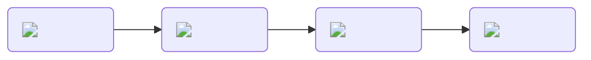

# Hi there 👋

My name is Brock and I currently work at Disney leading the infrastructure team for Disney+, Hulu, ESPN+, and Star+

```mermaid
graph LR;
    A[(&lt;img src&#61;&#39;https://media0.giphy.com/media/WdmFmeCW8ehi7KFwXE/giphy.gif&#39; width&#61;&#39;desired_width&#39; /&gt;)]
    A --> B[(&lt;img src&#61;&#39;https://www.warnermedia.com/themes/custom/com/images/prism-loader.gif&#39; width&#61;&#39;desired_width&#39; /&gt;)]
    B --> C[(&lt;img src&#61;&#39;https://c.tenor.com/dJT6gU0uSkMAAAAi/clippy-paperclip.gif&#39; width&#61;&#39;desired_width&#39; /&gt;)]
    C --> D[(&lt;img src&#61;&#39;https://media.giphy.com/media/cIxxFKOTCPwX9DUk7L/giphy.gif&#39&#39; width&#61;&#39;desired_width&#39; /&gt;)]
```

## My Public GitHub Stats 📈

<!-- Here are some ideas to get you started:

- 🔭 I’m currently working on ...
- 🌱 I’m currently learning ...
- 👯 I’m looking to collaborate on ...
- 🤔 I’m looking for help with ...
- 💬 Ask me about ...
- 📫 How to reach me: ...
- 😄 Pronouns: ...
- ⚡ Fun fact: ...
-->
